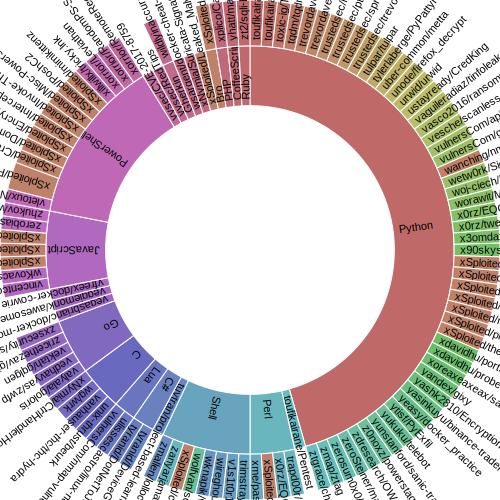
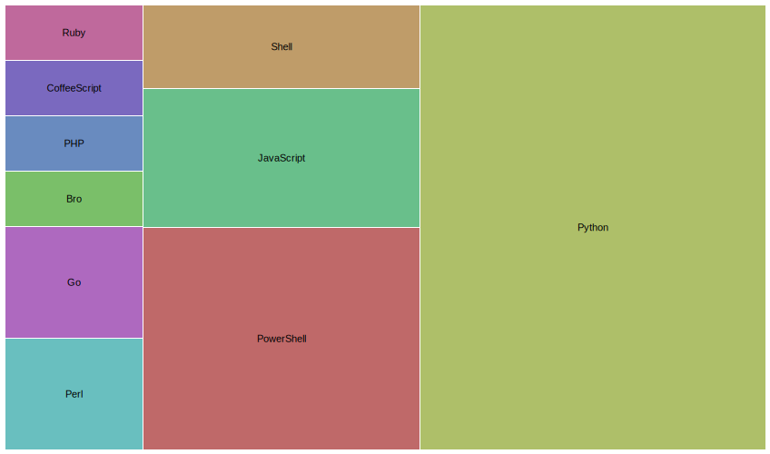

#  :star2: github-starmap
Python utility to export a user's starred repositories list into a CSV file

### Install

```bash
> git clone https://github.com/khast3x/github-starmap.git
> cd github-starmap
# Explicit python version for older systems
> pip3 install -r requirements.txt
> python3 starmap.py --help
```

### Usage

```bash
> python starmap.py --help

        __ __   __           __
.-----.|__|  |_|  |--.--.--.|  |--.
|  _  ||  |   _|     |  |  ||  _  |
|___  ||__|____|__|__|_____||_____|
|_____|
        __  by @khast3x
.-----.|  |_.---.-.----.--------.---.-.-----.
|__ --||   _|  _  |   _|        |  _  |  _  |
|_____||____|___._|__| |__|__|__|___._|   __|
                                      |__|

usage: starmap.py [-h] -u USERNAME [-t TOKEN] [-o DEST_CSV]

Export target's starred repositories from github to a CSV file. You can either
use a github user token or call the api anonymously. This limited to 60
requests per hour.

optional arguments:
  -h, --help            show this help message and exit
  -u USERNAME, --username USERNAME
                        Target Github username
  -t TOKEN, --token TOKEN
                        Github token to allow more requests to API. Max is 60
                        requests per hour
  -o DEST_CSV, --output DEST_CSV
                        CSV output filename

```
> You can use https://app.rawgraphs.io or a worksheet software to manipulate your data

### :movie_camera: Demo

[](https://asciinema.org/a/179526)

#### :arrow_double_down: Made using [RAWGraphs](https://app.rawgraphs.io)




